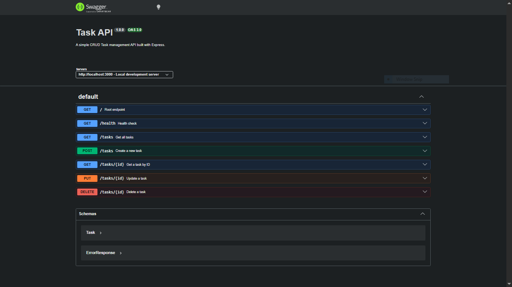

# Task Management CRUD API

A simple, lightweight RESTful API built with Node.js and Express to manage tasks. This API tracks tasks locally in memory and serves interactive documentation via Swagger UI.

---

## Features

- **Full CRUD operations**: Create, Read, Update, and Delete tasks.
- **Payload Validation**: Automatic validation for required fields on item updates or creations.
- **Automatic ID Auto-incrementing**: Generates unique IDs safely without overlaps.
- **Interactive Documentation**: Built-in Swagger UI generated dynamically from an `openapi.json` schema.

---

## Getting Started

### 1. Prerequisites
Ensure you have **Node.js** installed on your local machine.

### 2. Installation
Navigate to the root of project directory and install all required dependencies directly from the existing `package.json`:

```bash
npm install
```

### 3. Run the Server
Launch the application using your configured development environment script:

```bash
npm run dev
```

The terminal will display the active connection confirmation log:
```text
Server is running on port 3000
```

---

## API Documentation

Once your application is running, you can access the interactive API docs panel directly in your browser:

🔗 **Swagger UI Docs Dashboard**: [http://localhost:3000/docs](http://localhost:3000/docs)

### API Dashboard Preview


---

## Endpoint Summary

### Root & Utilities

| Method | Endpoint | Description | Status Code |
| :--- | :--- | :--- | :--- |
| **GET** | `/` | API version metadata | `200 OK` |
| **GET** | `/health` | Server uptime check status | `200 OK` |

### Task Resources

| Method | Endpoint | Request Body | Description | Success Code |
| :--- | :--- | :--- | :--- | :--- |
| **GET** | `/tasks` | *None* | Fetch all tasks | `200 OK` (or `404`) |
| **GET** | `/tasks/:id` | *None* | Get task by specific numeric ID | `200 OK` (or `404`) |
| **POST** | `/tasks` | `{ "title": "string" }` | Add a new task | `201 Created` (or `400`) |
| **PUT** | `/tasks/:id` | `{ "title": "str", "done": bool }` | Modify task title or status | `200 OK` (or `400`/`404`) |
| **DELETE**| `/tasks/:id` | *None* | Delete a task by ID | `204 No Content` (or `404`) |

---

## Sample Request Payloads

### Create Task (`POST /tasks`)
**Body:**
```json
{
  "title": "Finish code assessment"
}
```

### Update Task (`PUT /tasks/1`)
**Body:** (You can provide either or both fields)
```json
{
  "title": "Review final submission",
  "done": true
}
```
