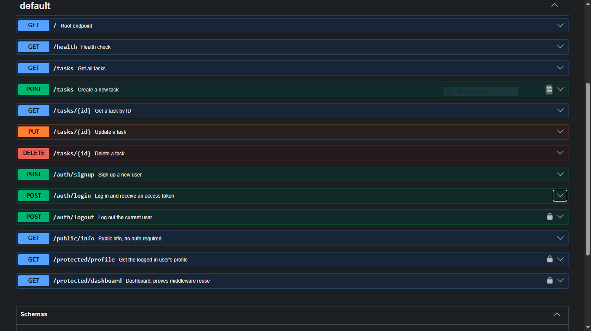

# Task Management CRUD API

A simple, lightweight RESTful API built with Node.js, Express, and SQLite using `better-sqlite3` to manage tasks. Tasks are persistently stored in a local SQLite database, and the API provides interactive documentation through Swagger UI.

---

## Features

* **Full CRUD operations**: Create, Read, Update, and Delete tasks.
* **SQLite Persistence**: Tasks are stored persistently in a local SQLite database instead of an in-memory array.
* **Payload Validation**: Validates required fields when creating or updating tasks.
* **Automatic ID Generation**: Task IDs are generated by SQLite.
* **Interactive Documentation**: Built-in Swagger UI generated from an `openapi.json` schema.
* **Health Check**: Provides an endpoint to verify that the server is running.

---

## Tech Stack

* **Node.js**
* **Express.js**
* **SQLite**
* **better-sqlite3**
* **Swagger UI**
* **OpenAPI**

---

## Getting Started

### 1. Prerequisites

Ensure you have **Node.js** installed on your local machine.

SQLite does not require a separate database server. The application uses `better-sqlite3` to create and interact with the local SQLite database file.

### 2. Installation

Navigate to the root of the project directory and install all required dependencies from `package.json`:

```bash
npm install
```

### 3. Run the Server

Launch the application using:

```bash
npm run dev
```

The terminal should display a message similar to:

```text
Server is running on port 3000
```

The SQLite database will be created/used locally by the application.

---

## API Documentation

Once your application is running, access the interactive API documentation in your browser:

🔗 **Swagger UI Docs Dashboard**: http://localhost:3000/docs

### API Dashboard Preview



---

## Endpoint Summary

### Root & Utilities

| Method  | Endpoint  | Description                | Status Code |
| :------ | :-------- | :------------------------- | :---------- |
| **GET** | `/`       | API version metadata       | `200 OK`    |
| **GET** | `/health` | Server health/uptime check | `200 OK`    |

### Task Resources

| Method     | Endpoint     | Request Body                          | Description                 | Success Code                |
| :--------- | :----------- | :------------------------------------ | :-------------------------- | :-------------------------- |
| **GET**    | `/tasks`     | *None*                                | Fetch all tasks from SQLite | `200 OK`                    |
| **GET**    | `/tasks/:id` | *None*                                | Get a task by its ID        | `200 OK` (or `404`)         |
| **POST**   | `/tasks`     | `{ "title": "string" }`               | Create a new task           | `201 Created` (or `400`)    |
| **PUT**    | `/tasks/:id` | `{ "title": "string", "done": bool }` | Update a task               | `200 OK` (or `400`/`404`)   |
| **DELETE** | `/tasks/:id` | *None*                                | Delete a task               | `204 No Content` (or `404`) |

---

## Sample Request Payloads

### Create Task (`POST /tasks`)

**Body:**

```json
{
  "title": "Finish code assessment"
}
```

### Update Task (`PUT /tasks/1`)

**Body:** You can provide either or both fields.

```json
{
  "title": "Review final submission",
  "done": true
}
```

---

## Data Persistence

Previously, tasks were stored in an in-memory array. This meant that all tasks were lost whenever the server restarted.

The application now uses **SQLite with `better-sqlite3`** for persistent storage. Tasks are saved in a local database file and remain available after restarting the server.

---

## Project Flow

```text
Client
   │
   ▼
Express REST API
   │
   ▼
Task Routes / Controllers
   │
   ▼
better-sqlite3
   │
   ▼
SQLite Database
```

Swagger UI provides an interactive interface for testing the available API endpoints.

---

## Notes

* The SQLite database is stored locally as a database file used by the application.
* No separate database server is required.
* Make sure the application has permission to create and write to the database file.
* The database file should generally be excluded from version control if you do not want to commit local application data.
